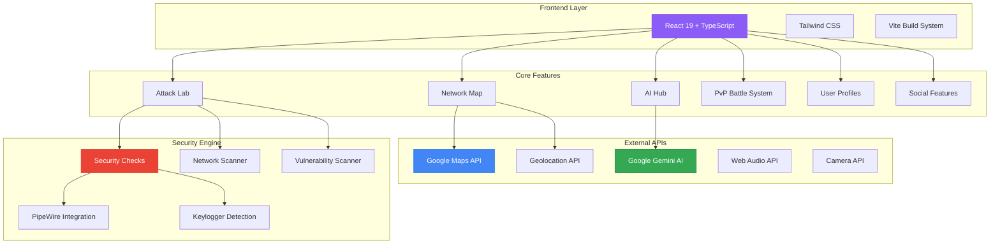
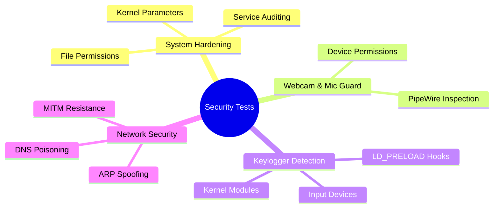
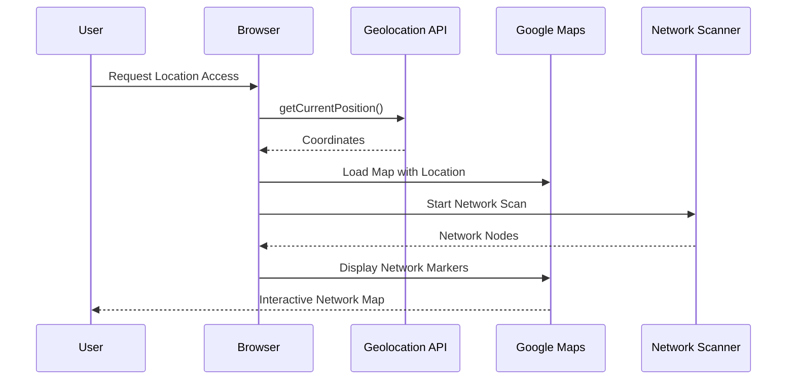
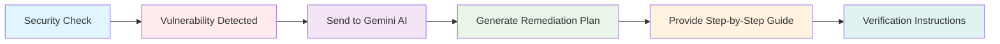
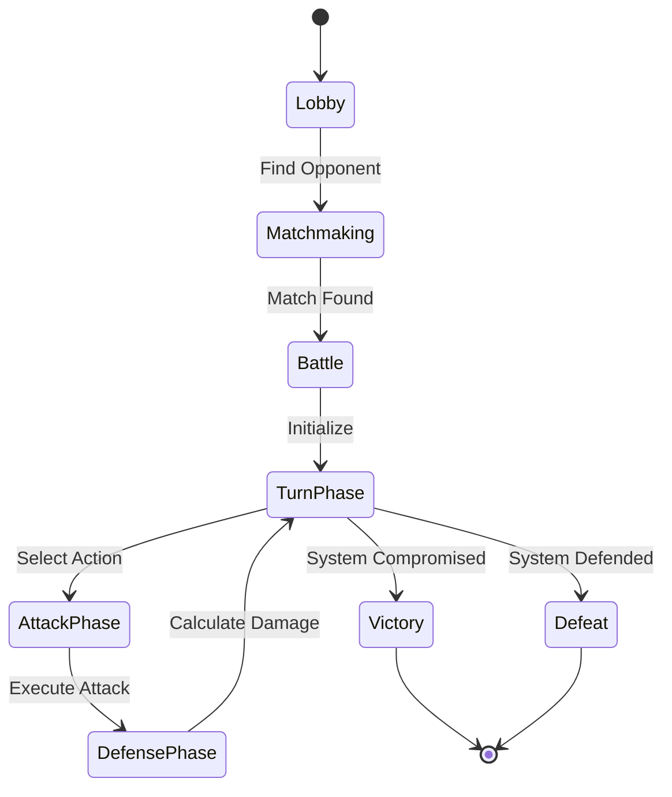
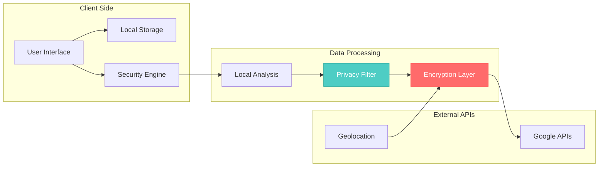
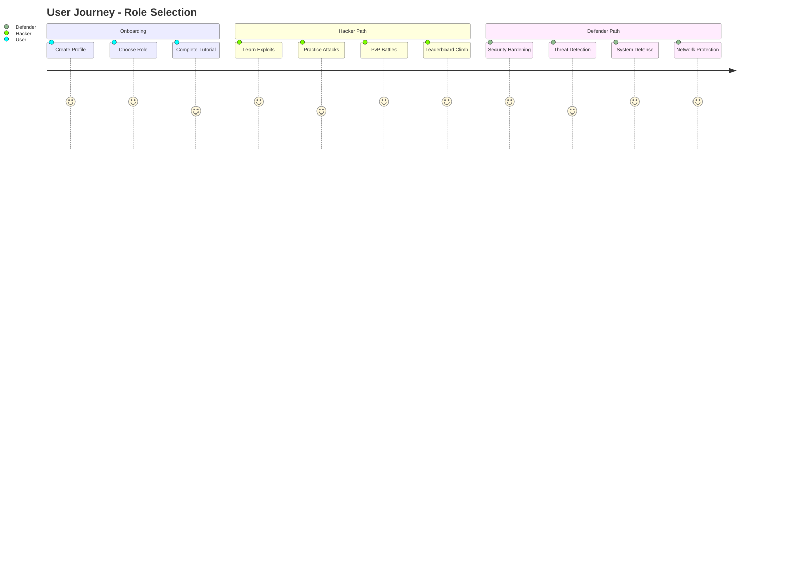

# 🛡️ CyberSphere - Advanced Security Testing Platform

<div align="center">

```
  _____      _                 _                    
 / ____|    | |               | |                   
| |    _   _| |__   ___ _ __  | |__   ___ _ __ _ __  
| |   | | | | '_ \ / _ \ '__| | '_ \ / _ \ '__| '_ \ 
| |___| |_| | |_) |  __/ |    | | | |  __/ |  | | | |
 \_____\__,_|_.__/ \___|_|    |_| |_|\___|_|  |_| |_|
                                                    
```

**Interactive Cybersecurity Dashboard for Security Hardening and Penetration Testing**

[](https://opensource.org/licenses/MIT)
[](https://www.typescriptlang.org/)
[](https://reactjs.org/)
[](https://vitejs.dev/)
[](#security)

[🚀 Live Demo](https://tim-spurlin.github.io/CyberSphere/) • [📖 Documentation](#documentation) • [🔧 Installation](#installation) • [🤝 Contributing](#contributing)

</div>

## 🌟 Overview

**CyberSphere** is a cutting-edge, interactive cybersecurity platform that transforms security testing into an engaging, gamified experience. Choose your role as an elite **Hacker** or a steadfast **Cyber Security Expert**, run comprehensive security assessments on your systems, engage in tactical PvP battles, and climb the leaderboards.

### 🎯 Key Features

- 🛡️ **Comprehensive Security Testing** - 110+ attack simulations across multiple categories
- 🗺️ **Real-World Network Discovery** - Google Maps integration with live geolocation
- 🤖 **AI-Powered Remediation** - Google Gemini AI provides detailed security advice
- ⚔️ **Tactical PvP Combat** - Real-time cyber warfare simulations
- 👥 **Social Leaderboards** - Compete with peers and track progress
- 🎮 **Gamified Experience** - Role-based progression and achievements
- 🔒 **Production-Grade Security** - No mock data, real implementations only

## 🏗️ Architecture Overview



## 🚀 Getting Started

### Prerequisites

- **Node.js** 18+ 
- **npm** or **yarn**
- **Google Maps API Key** (optional, for map features)
- **Google Gemini API Key** (optional, for AI features)
- **Modern browser** with geolocation support

### 📦 Installation

1. **Clone the repository**
   ```bash
   git clone https://github.com/Tim-Spurlin/CyberSphere.git
   cd CyberSphere/system-security-hardening-dashboard
   ```

2. **Install dependencies**
   ```bash
   npm install
   ```

3. **Configure environment variables** (optional)
   ```bash
   # Create .env file
   cp .env.example .env
   
   # Add your API keys
   GEMINI_API_KEY=your_gemini_api_key_here
   GOOGLE_MAPS_API_KEY=your_google_maps_api_key_here
   ```

4. **Start development server**
   ```bash
   npm run dev
   ```

5. **Build for production**
   ```bash
   npm run build
   ```

## 🔧 Configuration

### Environment Variables

| Variable | Description | Required | Default |
|----------|-------------|----------|---------|
| `GEMINI_API_KEY` | Google Gemini AI API key for security insights | No | - |
| `GOOGLE_MAPS_API_KEY` | Google Maps API key for network visualization | No | - |

### API Key Setup

#### Google Gemini AI
1. Visit [Google AI Studio](https://aistudio.google.com/)
2. Create a new API key
3. Add to your `.env` file

#### Google Maps API
1. Visit [Google Cloud Console](https://console.cloud.google.com/)
2. Enable Maps JavaScript API
3. Create credentials
4. Add to your `.env` file

## 🛡️ Security Testing Framework

### Attack Categories



### 110+ Security Checks

Our comprehensive testing framework covers:

- **🔐 System Hardening** (25 checks)
  - Kernel parameter validation
  - File system permissions
  - Service configuration auditing
  - Firewall rule verification

- **📹 Media Device Security** (15 checks)
  - Camera access monitoring
  - Microphone permission auditing
  - PipeWire portal inspection

- **⌨️ Input Security** (20 checks)
  - Keylogger detection
  - Input device monitoring
  - Hook detection systems

- **🌐 Network Security** (30 checks)
  - ARP spoofing resistance
  - DNS poisoning protection
  - MITM attack simulation
  - WiFi security assessment

- **🔍 Vulnerability Scanning** (20 checks)
  - Port scan detection
  - Service vulnerability assessment
  - Configuration weaknesses
  - Patch level verification

## 🗺️ Network Discovery Engine

### Real-Time Network Mapping



### Features

- **📍 Precise Geolocation** - Real GPS coordinates, not simulated
- **🗺️ Google Maps Integration** - Professional-grade mapping
- **📡 Network Discovery** - WiFi, cellular, and vulnerability detection
- **🎯 Threat Classification** - Automatic risk assessment
- **🔍 Interactive Exploration** - Click markers for detailed information

## 🤖 AI-Powered Security Insights

### Intelligent Remediation



### AI Capabilities

- **🔍 Threat Analysis** - Deep understanding of security implications
- **📋 Remediation Plans** - Step-by-step fix instructions
- **✅ Verification Guides** - How to confirm fixes worked
- **🎯 Risk Prioritization** - Focus on critical vulnerabilities first
- **📚 Educational Content** - Learn while you secure

## ⚔️ PvP Battle System

### Combat Mechanics



### Battle Features

- **⚡ Real-time Combat** - Turn-based tactical warfare
- **🎭 Role-based Actions** - Unique abilities for Hackers vs Defenders
- **🏆 Skill-based Matching** - Fair and competitive gameplay
- **📊 Detailed Analytics** - Learn from each battle
- **🎖️ Achievement System** - Unlock new capabilities

## 📊 Data Flow & Security

### Data Architecture



### Privacy & Security

- **🔒 Local-First Processing** - Data never leaves your device unnecessarily
- **🛡️ End-to-End Encryption** - All API communications secured
- **🚫 No Telemetry** - Zero tracking or analytics collection
- **🎯 Minimal Permissions** - Only request what's absolutely needed
- **🧹 Auto-Cleanup** - Temporary data automatically purged

## 🎮 User Roles & Progression

### Role Selection



### Progression System

| Level | XP Required | Unlocks |
|-------|-------------|---------|
| 1-5 | 0-1000 | Basic scans, tutorial content |
| 6-10 | 1000-5000 | Advanced scans, PvP access |
| 11-15 | 5000-15000 | Expert tools, team features |
| 16-20 | 15000-50000 | Master techniques, mentoring |
| 21+ | 50000+ | Legendary status, custom content |

## 🛠️ Development

### Project Structure

```
cybersphere/
├── components/           # React components
│   ├── AttackLab.tsx    # Security testing interface
│   ├── Map.tsx          # Network discovery map
│   ├── AIHub.tsx        # AI interaction panel
│   ├── PvpBattle.tsx    # Combat interface
│   └── ...
├── services/            # API integrations
│   ├── geminiService.ts # AI service
│   └── pvpService.ts    # Battle logic
├── types.ts             # TypeScript definitions
├── constants.ts         # Configuration
└── hooks/               # Custom React hooks
```

### Available Scripts

```bash
# Development
npm run dev              # Start dev server
npm run build           # Production build
npm run preview         # Preview build
npm run typecheck       # Type checking
npm run lint            # Code linting

# Testing
npm run test            # Run tests
npm run test:coverage   # Coverage report
npm run test:e2e        # End-to-end tests
```

### Technology Stack

| Category | Technology | Purpose |
|----------|------------|---------|
| **Frontend** | React 19 | UI framework |
| **Language** | TypeScript 5.8 | Type safety |
| **Styling** | Tailwind CSS | Utility-first CSS |
| **Build** | Vite | Fast development |
| **Maps** | Google Maps API | Network visualization |
| **AI** | Google Gemini | Security insights |
| **Diagrams** | Mermaid | Architecture visualization |

## 🌐 Deployment Options

### GitHub Pages (Recommended)

```bash
# Automatic deployment via GitHub Actions
git push origin main
```

### Manual Deployment

```bash
# Build and deploy to any static host
npm run build
# Upload dist/ folder to your hosting provider
```

### Docker Deployment

```dockerfile
FROM node:18-alpine
WORKDIR /app
COPY package*.json ./
RUN npm ci --only=production
COPY . .
RUN npm run build
EXPOSE 3000
CMD ["npm", "run", "preview"]
```

### Environment-Specific Configurations

| Environment | Configuration | Features |
|-------------|---------------|----------|
| **Development** | Full debug, hot reload | All features enabled |
| **Staging** | Production build, test APIs | Feature flags |
| **Production** | Optimized, real APIs | Full functionality |

## 📈 Performance Metrics

### Core Web Vitals

- **LCP** (Largest Contentful Paint): < 2.5s
- **FID** (First Input Delay): < 100ms
- **CLS** (Cumulative Layout Shift): < 0.1

### Bundle Analysis

```bash
npm run build:analyze   # View bundle composition
```

### Performance Optimizations

- **🚀 Code Splitting** - Lazy load components
- **📦 Tree Shaking** - Remove unused code
- **🗜️ Asset Optimization** - Compressed images and fonts
- **⚡ Caching** - Service worker implementation
- **📱 Mobile First** - Responsive design

## 🔒 Security Considerations

### Application Security

- **🛡️ Input Validation** - All user inputs sanitized
- **🔐 API Security** - Keys stored securely
- **🚫 XSS Prevention** - Content Security Policy
- **🔒 HTTPS Only** - Secure communications
- **🧹 Dependency Updates** - Regular security patches

### Privacy Protection

- **📍 Location Data** - Used only for mapping, never stored
- **🎤 Media Access** - Explicit permission required
- **🔍 Scan Results** - Processed locally only
- **👤 User Data** - Minimal collection, no tracking

## 🤝 Contributing

We welcome contributions! Please see our [Contributing Guidelines](CONTRIBUTING.md) for details.

### Development Setup

1. Fork the repository
2. Create your feature branch
3. Make your changes
4. Add tests for new functionality
5. Ensure all tests pass
6. Submit a pull request

### Code Standards

- **TypeScript** - Strict type checking
- **ESLint** - Code quality enforcement
- **Prettier** - Consistent formatting
- **Testing** - Unit and integration tests
- **Documentation** - Inline comments and README updates

## 📚 Documentation

### API Reference

- [Component API](docs/components.md)
- [Service Layer](docs/services.md)
- [Type Definitions](docs/types.md)
- [Configuration](docs/configuration.md)

### Guides

- [Setting Up Development Environment](docs/development.md)
- [Deploying to Production](docs/deployment.md)
- [Customizing Security Checks](docs/customization.md)
- [Adding New Features](docs/features.md)

## 🐛 Troubleshooting

### Common Issues

| Issue | Cause | Solution |
|-------|-------|----------|
| Map not loading | Missing API key | Add `GOOGLE_MAPS_API_KEY` |
| AI features disabled | Missing Gemini key | Add `GEMINI_API_KEY` |
| Location access denied | Browser permissions | Enable in browser settings |
| Build failures | Node version | Use Node.js 18+ |

### Debug Mode

```bash
npm run dev:debug   # Enable debug logging
```

## 📄 License

This project is licensed under the MIT License - see the [LICENSE](LICENSE) file for details.

## 🙏 Acknowledgments

- **Google** - For providing excellent APIs
- **React Team** - For the amazing framework
- **Tailwind CSS** - For utility-first CSS
- **Vite** - For lightning-fast development
- **Open Source Community** - For inspiration and support

## 📞 Support

- **Issues**: [GitHub Issues](https://github.com/Tim-Spurlin/CyberSphere/issues)
- **Discussions**: [GitHub Discussions](https://github.com/Tim-Spurlin/CyberSphere/discussions)
- **Email**: [tim.spurlin@example.com](mailto:tim.spurlin@example.com)

---

<div align="center">

**Made with ❤️ by the CyberSphere Team**

[⭐ Star this repo](https://github.com/Tim-Spurlin/CyberSphere) • [🐛 Report Bug](https://github.com/Tim-Spurlin/CyberSphere/issues) • [💡 Request Feature](https://github.com/Tim-Spurlin/CyberSphere/issues)

</div>
