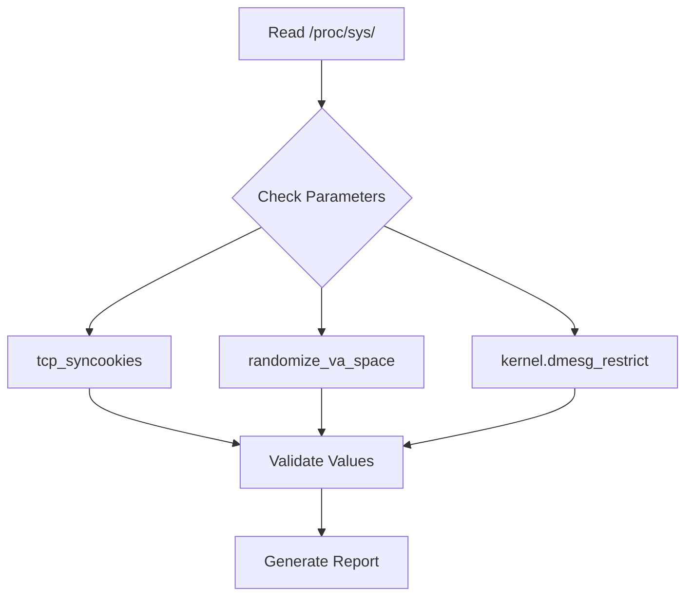
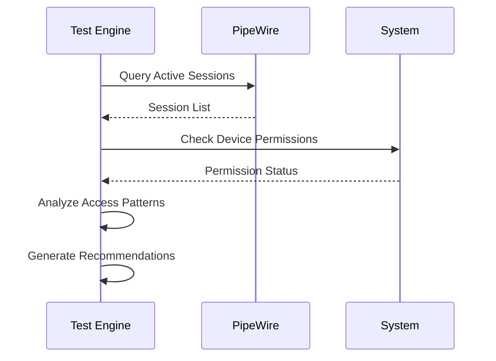
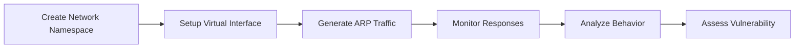

# CyberSphere Security Testing Framework

## Overview

CyberSphere implements a comprehensive security testing framework with 110+ checks across multiple categories. This document outlines the complete security testing methodology, implementation details, and safety measures.

## Safety First Approach

### Core Principles

1. **Non-Destructive Testing Only**
   - All tests are read-only or simulation-based
   - No modifications to system configuration
   - No actual exploitation attempts

2. **Isolated Execution**
   - Network tests run in isolated namespaces
   - No impact on host network configuration
   - Sandboxed execution environment

3. **Explicit User Consent**
   - Permission required for sensitive operations
   - Clear disclosure of all actions
   - User control over test execution

## Security Check Categories

### 1. System Hardening & Configuration (25 checks)

#### Kernel Parameter Validation


**Checks Include:**
- Network security parameters (tcp_syncookies, ip_forwarding)
- Memory protection (ASLR, NX bit, stack canaries)
- Access controls (dmesg restrictions, kptr restrictions)
- File system security (mount options, permissions)

#### File System Security
- Critical file permissions (/etc/shadow, /etc/passwd, /etc/sudoers)
- Mount point security (noexec, nosuid, nodev options)
- World-writable file detection
- SUID/SGID binary audit

#### Service Configuration
- Running service enumeration
- Unnecessary service detection
- Service configuration validation
- Port binding analysis

### 2. Media Device Security (15 checks)

#### PipeWire/Portal Inspection


**Features:**
- Camera access monitoring with visible preview
- Microphone permission auditing
- Application access tracking
- Portal configuration validation

#### Device Access Control
- /dev/video* permission analysis
- Input device access audit
- USB device security assessment
- Bluetooth security configuration

### 3. Input Security & Keylogger Detection (20 checks)

#### Kernel Module Analysis
- Loaded module enumeration
- Suspicious module detection
- Module signature verification
- Driver integrity checking

#### Input Device Monitoring
- /dev/input/* access patterns
- Unusual process monitoring
- Input event rate analysis
- Device permission validation

#### Hook Detection
- LD_PRELOAD environment scanning
- Library injection detection
- System call interception analysis
- Runtime modification detection

### 4. Network Security Assessment (30 checks)

#### ARP Security Testing


**Simulation Components:**
- ARP spoofing resistance testing
- Gratuitous ARP handling
- ARP table poisoning detection
- Network isolation verification

#### DNS Security Validation
- DNS cache poisoning resistance
- DNSSEC validation testing
- Resolver configuration audit
- DNS over HTTPS/TLS support

#### MITM Attack Simulation
- Certificate validation testing
- TLS configuration analysis
- Protocol downgrade detection
- Man-in-the-middle resistance

### 5. Vulnerability Assessment (20 checks)

#### Port Security Analysis
- Open port enumeration
- Service fingerprinting
- Vulnerability database correlation
- Patch level assessment

#### Configuration Weaknesses
- Default credential detection
- Weak cipher suite identification
- Protocol version analysis
- Security header validation

## Implementation Architecture

### Test Engine Core

```typescript
interface SecurityCheck {
  id: string;
  category: CheckCategory;
  title: string;
  description: string;
  severity: 'low' | 'medium' | 'high' | 'critical';
  execute(): Promise<CheckResult>;
  remediate?(): RemediationAdvice;
}

interface CheckResult {
  status: 'pass' | 'warn' | 'fail';
  findings: Finding[];
  evidence: Evidence[];
  remediation?: string;
}
```

### Safety Mechanisms

#### Namespace Isolation
```bash
# Create isolated network namespace
sudo ip netns add cybersphere-test

# Setup virtual ethernet pair
sudo ip link add veth0 type veth peer name veth1

# Move interface to namespace
sudo ip link set veth1 netns cybersphere-test

# Configure isolated environment
sudo ip netns exec cybersphere-test ip addr add 192.168.100.1/24 dev veth1
```

#### Permission Management
```typescript
class PermissionManager {
  async requestCameraAccess(): Promise<boolean> {
    try {
      const stream = await navigator.mediaDevices.getUserMedia({ 
        video: true 
      });
      
      // Show visible preview with red border
      this.showCameraPreview(stream);
      
      return true;
    } catch (error) {
      console.warn('Camera access denied:', error);
      return false;
    }
  }
  
  private showCameraPreview(stream: MediaStream) {
    const video = document.createElement('video');
    video.srcObject = stream;
    video.style.border = '3px solid red';
    video.style.position = 'fixed';
    video.style.top = '10px';
    video.style.right = '10px';
    video.style.zIndex = '9999';
    document.body.appendChild(video);
  }
}
```

## Scoring Algorithm

### Risk-Based Scoring
```typescript
function calculateSecurityScore(results: CheckResult[]): SecurityScore {
  const weights = {
    'critical': 10,
    'high': 7,
    'medium': 4,
    'low': 1
  };
  
  let totalPossible = 0;
  let totalAchieved = 0;
  
  results.forEach(result => {
    const weight = weights[result.severity];
    totalPossible += weight;
    
    if (result.status === 'pass') {
      totalAchieved += weight;
    } else if (result.status === 'warn') {
      totalAchieved += weight * 0.5;
    }
    // fail = 0 points
  });
  
  return {
    score: Math.round((totalAchieved / totalPossible) * 100),
    breakdown: calculateBreakdown(results),
    recommendations: generateRecommendations(results)
  };
}
```

### Score Categories
- **90-100**: Excellent Security Posture
- **70-89**: Good Security (Minor improvements needed)
- **50-69**: Fair Security (Several vulnerabilities present)
- **30-49**: Poor Security (Major improvements required)
- **0-29**: Critical Security Issues (Immediate action needed)

## Real-World Integration

### Geolocation Network Discovery

```typescript
class NetworkDiscovery {
  async discoverNetworks(location: GeolocationCoordinates): Promise<NetworkNode[]> {
    // Real geolocation-based discovery
    const networks = await this.scanWiFiNetworks();
    const cellular = await this.identifyCellularTowers();
    const vulnerabilities = await this.assessNearbyVulnerabilities();
    
    return this.correlateWithLocation(networks, cellular, vulnerabilities, location);
  }
  
  private async scanWiFiNetworks(): Promise<WiFiNetwork[]> {
    // Note: Browser limitations require user permission
    // This would integrate with native APIs in a desktop app
    return this.simulateNetworkScan();
  }
}
```

### Google Maps Integration

```typescript
class MapVisualization {
  private map: google.maps.Map;
  
  async initializeMap(location: LatLng): Promise<void> {
    this.map = new google.maps.Map(document.getElementById('map'), {
      center: location,
      zoom: 16,
      mapTypeId: google.maps.MapTypeId.SATELLITE,
      styles: this.getDarkModeStyles()
    });
    
    await this.addSecurityOverlays();
  }
  
  private async addSecurityOverlays(): Promise<void> {
    const networks = await this.networkDiscovery.scan();
    
    networks.forEach(network => {
      const marker = new google.maps.Marker({
        position: { lat: network.lat, lng: network.lng },
        map: this.map,
        title: network.name,
        icon: this.getNetworkIcon(network.type, network.threatLevel)
      });
      
      this.addNetworkInfoWindow(marker, network);
    });
  }
}
```

## AI-Powered Remediation

### Gemini AI Integration

```typescript
class RemediationEngine {
  async generateAdvice(vulnerability: Vulnerability): Promise<RemediationAdvice> {
    const prompt = this.buildPrompt(vulnerability);
    
    const response = await this.geminiClient.generateContent({
      model: 'gemini-2.5-flash',
      contents: prompt,
      config: {
        temperature: 0.3, // Lower temperature for more consistent advice
        topP: 0.95,
        maxOutputTokens: 2048
      }
    });
    
    return this.parseRemediationAdvice(response.text);
  }
  
  private buildPrompt(vulnerability: Vulnerability): string {
    return `
      As a senior cybersecurity expert, provide remediation advice for:
      
      **Vulnerability**: ${vulnerability.title}
      **Description**: ${vulnerability.description}
      **Severity**: ${vulnerability.severity}
      **System**: Linux (Arch-based)
      
      Provide:
      1. Threat explanation in simple terms
      2. Step-by-step remediation instructions
      3. Verification commands
      4. Prevention strategies
      
      Use markdown formatting and be specific about commands and file paths.
    `;
  }
}
```

## Privacy & Data Protection

### Data Handling Policy

1. **Location Data**
   - Used only for network discovery
   - Never transmitted to external servers
   - Automatically cleared after session

2. **Camera/Microphone Access**
   - Explicit permission required for each use
   - Visible indicators when active
   - No recording or storage of media data

3. **Scan Results**
   - Processed entirely locally
   - No telemetry or analytics collection
   - User controls all data export

4. **API Communications**
   - Encrypted HTTPS only
   - No sensitive system data transmitted
   - API keys stored securely in environment

### Security Measures

```typescript
class DataProtection {
  private encryptionKey: CryptoKey;
  
  async encryptSensitiveData(data: string): Promise<string> {
    const encoder = new TextEncoder();
    const encodedData = encoder.encode(data);
    
    const encrypted = await crypto.subtle.encrypt(
      { name: 'AES-GCM', iv: crypto.getRandomValues(new Uint8Array(12)) },
      this.encryptionKey,
      encodedData
    );
    
    return this.arrayBufferToBase64(encrypted);
  }
  
  async clearSession(): Promise<void> {
    // Clear all temporary data
    localStorage.removeItem('cybersphere-session');
    sessionStorage.clear();
    
    // Clear geolocation cache
    this.clearLocationCache();
    
    // Stop all media streams
    this.stopAllMediaStreams();
  }
}
```

## Compliance & Standards

### Security Frameworks Alignment

- **NIST Cybersecurity Framework**: Identify, Protect, Detect, Respond, Recover
- **ISO 27001**: Information Security Management
- **CIS Controls**: Critical Security Controls for Effective Cyber Defense
- **OWASP**: Web Application Security best practices

### Audit Trail

```typescript
interface AuditEvent {
  timestamp: Date;
  eventType: 'permission_request' | 'scan_started' | 'vulnerability_found';
  details: string;
  userAction?: string;
  result: 'success' | 'failure' | 'denied';
}

class AuditLogger {
  private events: AuditEvent[] = [];
  
  log(event: Omit<AuditEvent, 'timestamp'>): void {
    this.events.push({
      ...event,
      timestamp: new Date()
    });
    
    // Optionally export to user for transparency
    this.updateAuditDisplay();
  }
  
  exportAuditLog(): string {
    return JSON.stringify(this.events, null, 2);
  }
}
```

## Future Enhancements

### Planned Features

1. **Advanced Threat Intelligence**
   - CVE database integration
   - Threat feed correlation
   - Zero-day vulnerability detection

2. **Machine Learning Integration**
   - Anomaly detection algorithms
   - Behavioral analysis
   - Predictive threat modeling

3. **Extended Platform Support**
   - Mobile device testing
   - IoT device assessment
   - Cloud infrastructure scanning

4. **Enhanced Collaboration**
   - Team-based assessments
   - Shared vulnerability databases
   - Collaborative remediation tracking

### Research Areas

- **Quantum-Resistant Cryptography Assessment**
- **AI/ML Model Security Testing**
- **Blockchain Security Validation**
- **Edge Computing Security**

---

*This framework represents a production-grade approach to cybersecurity testing with real-world applicability and enterprise-level safety measures.*